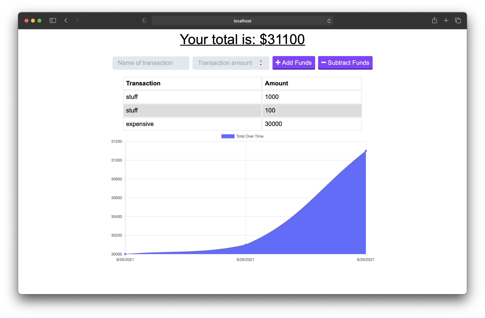

<h1 align="center">Budget Tracker 👋</h1>

 

## Description

🔍 The user will be able to add expenses and deposits to their budget with or without a connection. When entering transactions offline, they should populate the total when brought back online.

## Table of Contents

- [Description](#description)
- [Installation](#installation)
- [Usage](#usage)
- [License](#license)
- [Contributing](#contributing)
- [Tests](#tests)
- [Questions](#questions)

## Installation

💾 run npm i, then npm start.

## Usage

💻 To track and manage your spending, as well as see a graphical analysis of your spending.

## License

 
This application is covered by the MIT license.

## Contributing

👪 Ethan Morris

## Tests

✏️ No tests are included.

## Questions

✋ Contact me or submit an issue. 
 
:octocat: Find me on GitHub: [Gimbalbyte](https://github.com/Gimbalbyte) 
 
✉️ Email me with any questions: ethan.morris571@gmail.com  

## Images

